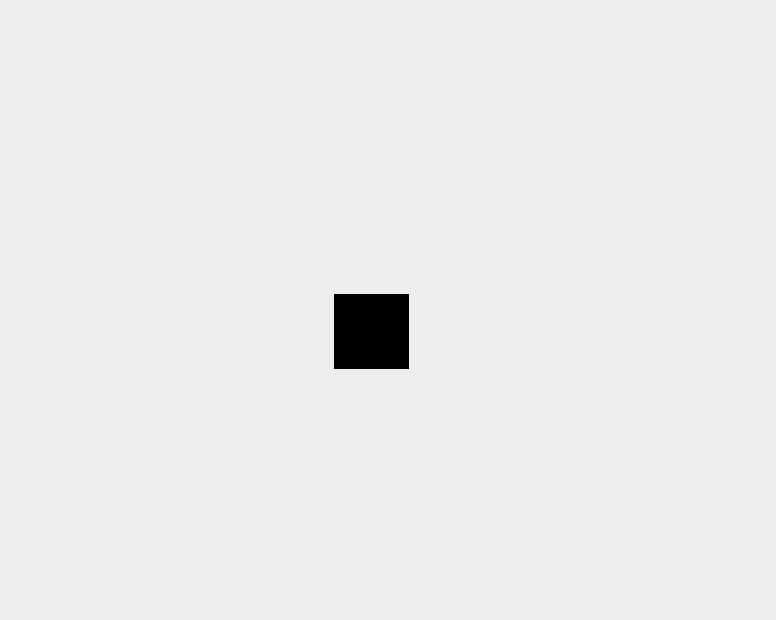

# Phase Screenshots
Live Link: https://hamidjae.github.io/is120-hw8-hamidjaeyoung-jahangir/

These are the best images I could take of the different phases of the homework.

# Explain how you got certain stages of the animation completed and what it was like to break this problem down step by step.

This homework was actually quite difficult for me. My initial thought when it came to breaking this animation down was to treat each separate shape as its own entity, and seeing how all three of them behaved according to the sample animation.

The very first thing I noticed was that the inner black box gradually went from zero to filling the full width, which is where I got the initial idea in the first image. Having a perimeter that the two L-shaped pieces could slot into felt like the best way to complete this project. I used W3Schools and different YouTube videos to try and figure out the different animation properties, as well as trying to understand the class file in the repo. After making one of the L's, the other one was pretty straightforward as all I had to do was mirror the properties of the left-side L to the right-side L.

However, the biggest problem that arose from this project was actually trying to "slice" the notches in the L's so that both ends are chopped diagonally. I figured out how to do it for one side of the L on the left side, but I was not able to figure out how to do it on the right side or figuring out how to chop off the other end on the left side. This ultimately became the one thing about this homework I could not figure out, unfortunately, as I had run out of time since the homework had occupied most of this day for me.

Breaking the project down though made it extremely straightforward, as putting different keyframes felt natural considering I had a reference to go off of from both the class repo and the sample animation.

# Describe when something didn't work as expected. Maybe something you had to change or learned because of it

When I initially was creating the right side of the L, for some reason the shape was cutting itself off and creating itself back again at the ends only. This took quite a while to figure out, and I had to really look deep into how clip-path worked. Essentially, mirroring the shape actually required me to allow clip-path to automatically set up one of the sides, because otherwise my parameters were treating it as if the shape was running backwards, which explains why there was a weird gap between one side of the shapes. Handling the L's was the most important part of this homework for me, since I had to learn how clip-path actually worked.
